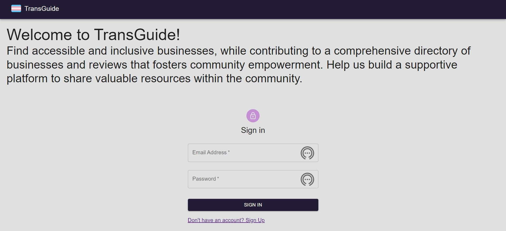
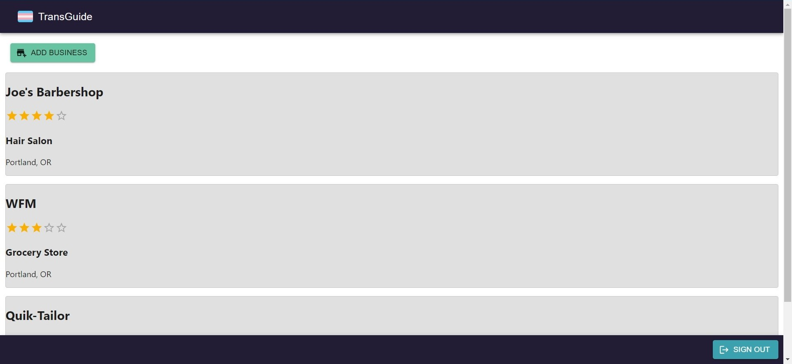

# Epicodus Capstone Project: TransGuide Reviews

### By Dani Steely

#### [Epicodus][Epicodus] capstone project completed for C# and React Part-Time [coursework][coursework]. TransGuide is a mobile-friendly website that allows an authorized user to create anonymous reviews of businesses or medical establishments in terms of their trans-inclusivity or general trans-friendliness. All users should be able to view a list of businesses and reviews, and should be able to sort/filter/group/search businesses and reviews. Users with an account should be able to add businesses to the index and create reviews for any business.

  

### Feature Goals:
* Firebase database and Firebase authorization ✅
* Secure accounts setup ✅
* Add business listings/reviews ✅
* Search and group businesses by category, location
* Sort businesses by properties

### Stretch Goals
* Employee reviews of the business as well...
* Accesible and mobile-friendly styling with semantic HTML and MUI ✅
* Automated content moderation
* User content reporting system

### Additional Stretch Goals
* Firebase storage for user-uploaded images
* Radar API
  - Address validation
  - Geocoding and map tile for display on business detail page

## Technologies Used:
* _Create-React-App_
* _JSX_
* _CSS_
* _Javascript_
* _React_
* _React-Router_
* _Firebase_
* _MUI_

## Project Description
This React app is a ratings and review website specificically for transgender people to share their experiences interacting with businesses. Users can create accounts, add business listings, and add reviews of businesses in terms of their inclusivity and trans-friendliness. The website emphasizes anonymity, account security, and accessibility. 

## Known Bugs
* I failed to implement user uploaded images and firebase storage for these images
  - I think there is an issue with CORS configuration, but I will need to try to implement this at a later time
* 

## Setup/Installation Requirements
* Clone this project from Github
* In the root directory, create a .env and add it to a .gitignore file
* Create a Firebase project and enable Authentication and Firestore Database
* You can use the .env file to store your keys from the sdk configuration

This project was bootstrapped with [Create React App](https://github.com/facebook/create-react-app).

### Available Scripts

In the project directory, you can run:

#### `npm start`

Runs the app in the development mode.\
Open [http://localhost:3000](http://localhost:3000) to view it in your browser.

The page will reload when you make changes.\
You may also see any lint errors in the console.

#### `npm test`

Launches the test runner in the interactive watch mode.\
See the section about [running tests](https://facebook.github.io/create-react-app/docs/running-tests) for more information.

#### `npm run build`

Builds the app for production to the `build` folder.\
It correctly bundles React in production mode and optimizes the build for the best performance.

The build is minified and the filenames include the hashes.\
Your app is ready to be deployed!

See the section about [deployment](https://facebook.github.io/create-react-app/docs/deployment) for more information.

#### `npm run eject`

**Note: this is a one-way operation. Once you `eject`, you can't go back!**

You can **learn more** in the [Create React App documentation](https://facebook.github.io/create-react-app/docs/getting-started).

To learn React, check out the [React documentation](https://reactjs.org/)

## License

_MIT License_

Copyright (c) _7/1/23_ _Dani Steely_

[Epicodus]: https://www.epicodus.com/
[coursework]: https://www.learnhowtoprogram.com/tracks/c-and-react-part-time
[repo]: https://github.com/DaniS91/Capstone-Project
